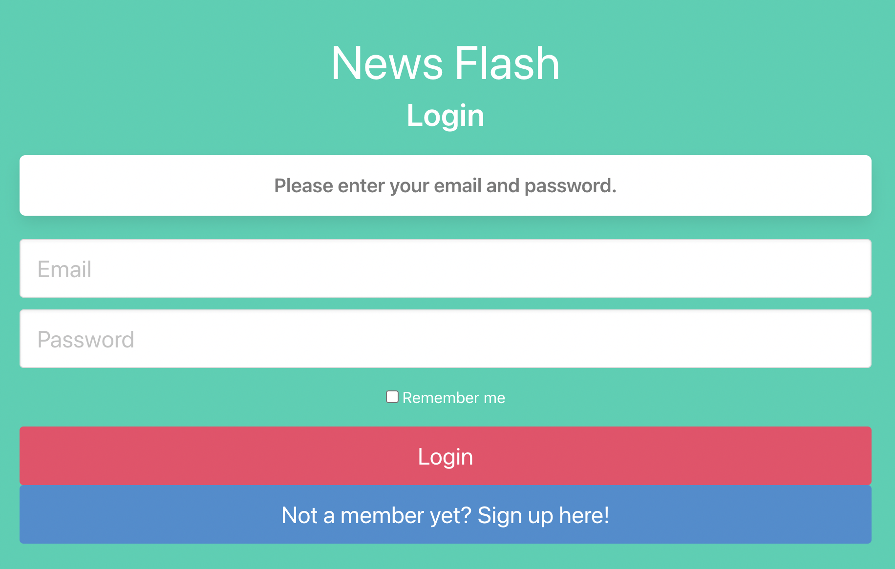

# News Flash

The second group project from the UofO Web Developement bootcamp

## User story:
  A website that currates news sources and allows me to select options for each news source that brings up different articles based on filter selections and saves them in a   user   profile
  When they go on to a website
  They type in my username and password
  Then hit the login button which brings up the main news page
  The default articles are the top stories from the New York Times
  Each News source has a drop down menu, when selected, will present the user with stories from that news source based on the filters
  The selected filters are then saved as a cookie on the server
  When the user returns and logs back in, they are presented with news stories based on the selected filters from thier previous session
  
## MVP:
  A website that allows the user to log in with a username and password
  has five different buttons for five different news sources, when selected presents user with source top stories
  the displayed stories will have article title, article image, and small excerpt from article
  saves user cookies between sessions
  NodeMon as new technology for assignment

## Technologies Used: 
HTML, Bulma, Javascript, MySQL, Sequelize

## Links:
* Repo: https://github.com/Marcus-Pi4/Group-Project-2
* Deployed Site:

## License: 
MIT

  
## Website Layout Wireframing:

  [Login Portal](https://user-images.githubusercontent.com/58586235/129135032-5c7a519f-cb9d-496d-8473-60a08513ce0d.png)

  [News Page](https://user-images.githubusercontent.com/58586235/129134998-7aa9d36f-6aaf-4a04-afa7-5e1bc34d687c.png)

## Created By: 
  * Ryan Logan
  * Marcus Reynolds
  * Rachel Wintersteen
  * Eva Popp
